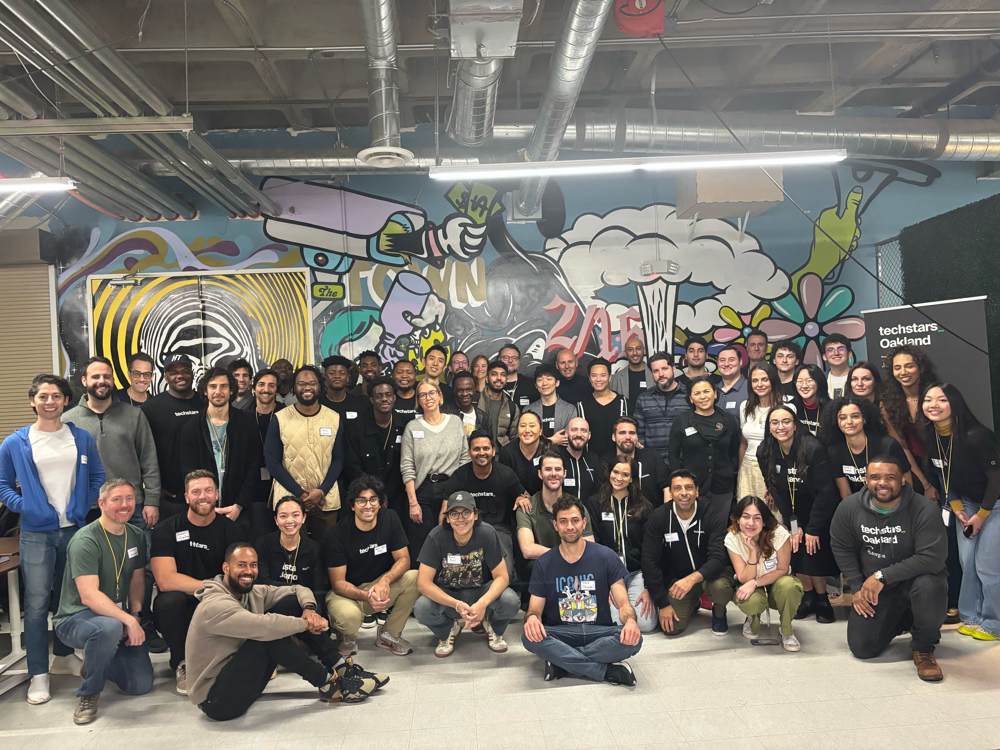
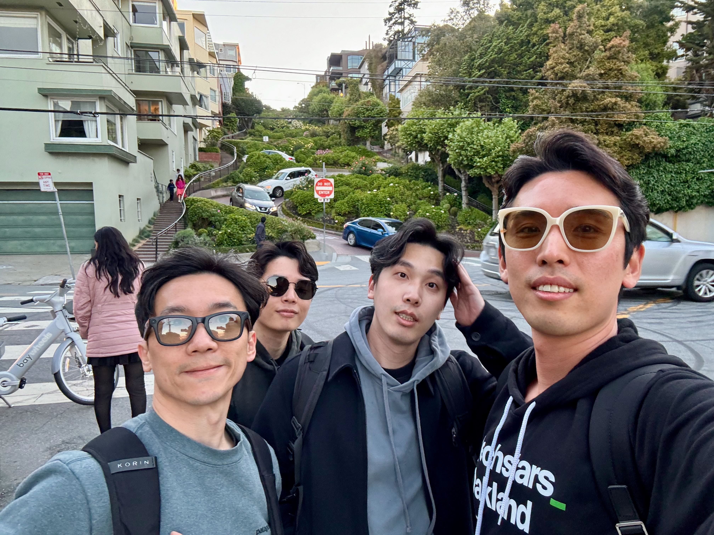
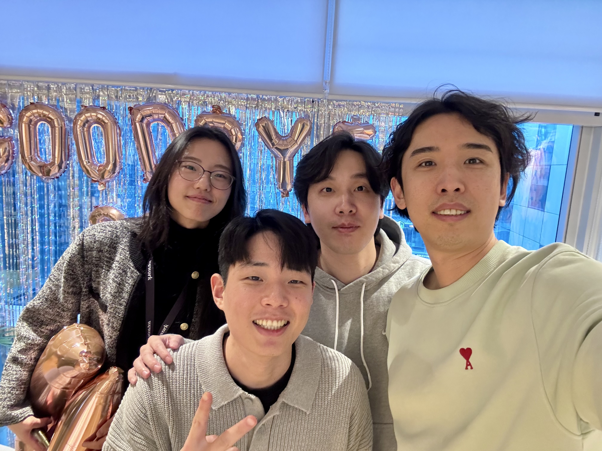
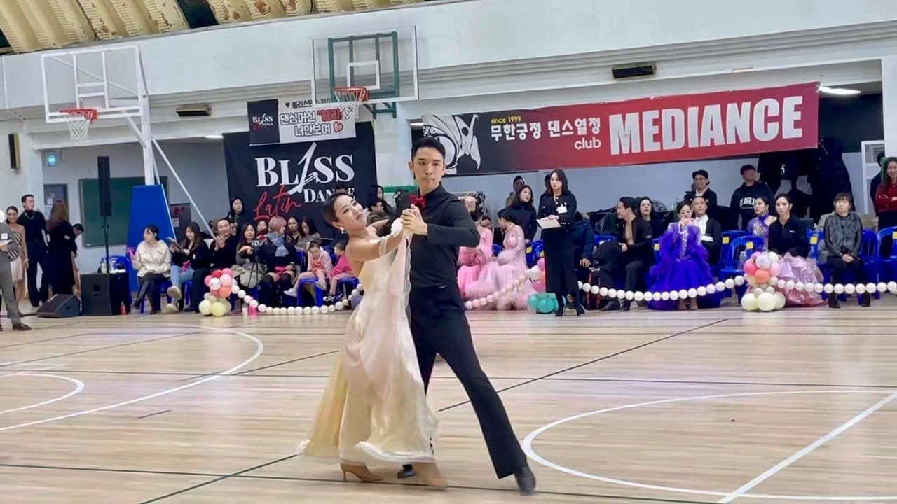
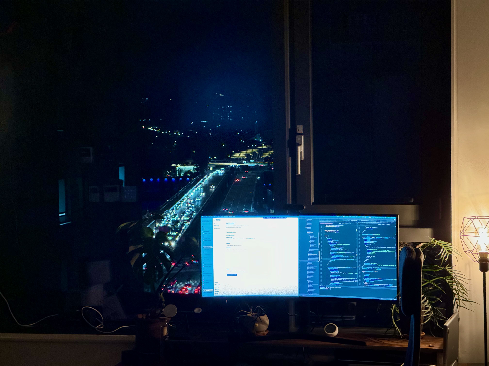
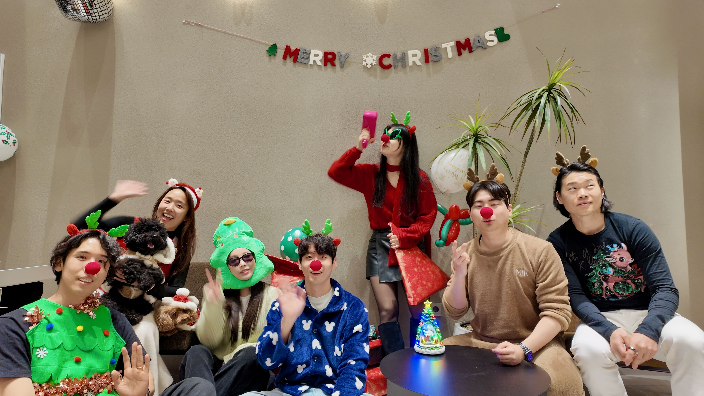

+++
title = '2024 연말 회고'
url = '/2024-retro'
date = 2024-12-30T15:26:49+09:00
draft = false
tags = ['retro']
+++

2024년이 끝나간다.
창업 이후 가장 많은 변화가 있었던 해였고, 회사와 개인적으로도 큰 도전과 성장이 있었다.

## 회사의 성장

작년에는 '머리에 불이 붙은 문제'를 찾아 헤매던 시기였다면, 올해는 그 문제를 해결하는 제품을 만들어 시장에서 검증받는 시기였다.

### 문제 정의에서 제품 출시까지

작년에는 60번이 넘는 인터뷰를 진행했다.
인터뷰를 하면서 한 가지 부정할 수 없는 전제를 확인할 수 있었는데, 바로 기업들이 LLM을 활용해 생산성을 개선하고 싶어한다는 것이었다.
(너무 당연하다.)
하지만 동시에 큰 도전 과제도 발견했다.
기업들이 실제로 LLM을 도입하고 유용한 수준에 도달하려면 특정 버티컬에서 깊은 연동이 필요하지만 많은 회사는 직접 그걸 하는 ROI가 나오지 않고 아직 검증도 덜 된 상태였다.
그런 문제를 해결해주고 싶은 스타트업으로써는 문제인지 아직 확실하지 않은 상태에서 우리에게 베팅하고 함께 만들어갈 디자인 파트너를 찾는 게 쉽지 않았다.
특히 우리가 ICP로 삼았던 Technical Customer Support 팀이나 SRE 팀은 대부분 시리즈 A 이상의 조직들에서 생겨나는 팀들이었다.
실무자나 팀 리드들은 문제가 있다고 말하고 우리가 제안하려는 솔루션에 관심을 보였지만, 실제로 도입하려면 어느정도 사이즈가 있는 조직 특성 상 긴 리드 타임과 컴플라이언스 같은 높은 진입 장벽을 넘어야 했다.
문제가 확실히 검증됐다면 당연히 감수해야 할 과정이었겠지만, 창업팀 입장에서는 아직 검증되지 않은 가설을 위해 긴 시간과 비용을 투자하기가 어려웠다.(반대편도 마찬가지다.)
전형적인 닭과 달걀의 문제였다.

전환점은 2023년 말 OpenAI DevDay였다.
많은 LLM 스타트업들의 '피의 결혼식'이 될 거란 말이 나올 정도로 파급력이 컸는데, OpenAI가 Custom GPTs와 Assistants API를 발표하면서 커스텀 AI를 만드는 게 훨씬 쉬워졌다.
ChatGPT 이후 AI/LLM 생태계가 정말 빠르게 변해왔지만, 여전히 이런 커스텀 AI를 실제 업무 도구에 도입하는 건 큰 간극이 있었다.
우리는 이 간극을 메우는 게 스타트업으로서 할 수 있는 가장 가치있는 일이라 생각했고, 1주일 만에 PlugBear를 출시했다.
PlugBear는 Custom LLM을 Slack, MS Teams, Discord, HubSpot 등 실제 업무 도구에 손쉽게 붙일 수 있는 no/low code LLM connector였다.

### Product-led Growth

사실 작년에도 린 스타트업 방식으로 랜딩 페이지랑 대기자 명단, 프로토타이핑 등 이것저것 실험을 많이 해봤다.
하지만 실험의 결과로는 이 문제가 실제로 있고 풀만한 가치가 있는지 판단하기가 어려웠다.
PlugBear는 달랐다.
ProductHunt에 런칭하고, Geeknews나 여타 미디어에 서비스를 소개했을 때 즉각적인 반응이 있었다.

MVP 단계 제품부터 공개한 만큼 접근 방법도 바꾸었다.
직전에 Pre Sales 방식을 시도했던 것과는 달리, 역시 우리가 더 잘 할 수 있다고 생각하는 Product-led Growth와 Build in Public 전략을 적극적으로 활용했다.
소셜 미디어에서 개발 중인 기능들을 공유하고, 매주 changelog를 올리면서 초기 팬들을 꾸준히 모았다.

### Traction

작년 연말에 제품을 가다듬고 2024년 1월 초부터 과금을 시작했는데, 예상 밖의 일이 벌어졌다.
유료 채널을 활용하지 않았지만 올거닉하게 유입된 초기 사용자들이 알아서 유료로 전환되기 시작했고, 아직 초반이지만 사용해줘서 감사하다는 의미로 진행한 얼리버드 프로모션을 통해 연간 구독을 선택하는 고객들도 나타났다.
이런 초기 성과 덕분에 Techstars 지원도 자신있게 할 수 있었다.

1년이 지난 지금, 우리는 139개의 유료 고객사를 확보했다.
단순히 숫자가 늘어난 게 아니라, 고객에 대한 이해도 많이 높아졌다.
Knowledge Base 연동을 통해 단순히 Slack에서 LLM을 쓰는 걸 넘어서서, 내부 지식을 기반으로 고객 응대나 내부 지원 부서들의 업무 부담을 실제로 줄여주는 제품으로 발전했다.

### Techstars와 함께한 3개월

작년 미국 출장 중에 Jina님을 통해 알게 된 Techstars는 우리한테 새로운 기회가 됐다.
지원하면서 JTBD나 재무 모델링처럼 실질적인 비즈니스 요소들을 강조하는 점이 인상 깊었고, 실질적으로 우리에게 도움이 되는 프로그램이라는 인상을 받았다.
프로그램에 합격하고 베이 지역에서 보낸 3개월은 정말 값진 시간이었다.

제품 메시지를 더 좁고 명확하게 다듬고, 주 단위로 KPI를 추적하면서 멘토들과 EIR들의 조언을 받아가며 개선했다.
덕분에 이 기간 동안 매출은 4배나 늘었고, 다양한 고객과 멘토들한테 배운 인사이트로 회사의 방향도 더 선명해졌다.

이 과정에서 제품 이름도 바뀌었다!
Techstars 동료들이 한결같이 'PlugBear'보다는 우리 회사 이름이자 작년에 시도했던 MVP인 'Runbear'가 어감도 좋고 더 브랜드명처럼 들린다고 조언해줬고, 결국 중반에 이름을 바꾸기로 했다.

### 팀의 성장

스타트업이라는 어려운 여정을 함께 하는데 있어서 가장 중요한 건 제품이나 매출보다도 결국 팀이다.
지난 창업 경험에서 배웠지만, 이 여정 중에는 풍랑도 만나고 제품이 엎어지고 피봇하고 강력한 경쟁자가 등장하는 등 크고 작은 일들이 수도 없이 일어난다.
그래서 더더욱 함께 가는 팀이 중요하다.

작년까지는 Snow와 둘이서 모든 걸 해결해야 했는데, 작년에 프리시드 투자를 받으면서 팀 빌딩을 본격적으로 시작할 수 있었다.
감사하게도 PlugBear를 키워나가야 하는 시기에 예전에 함께 일하면서 합이 잘 맞았고, 이미 좋은 경험을 쌓아온 Isac이랑 Joel이 합류해줬다.
제품을 키워나가는 중요한 시기에 이렇게 좋은 동료들이 함께 해준 게 정말 고마웠다.
여기에 Summer, Jeanie, Ali까지 합류하면서 7명의 팀이 됐고, 팀은 한층 더 단단해졌다.

여전히 작은 팀이지만 매일매일이 정말 바쁘다.
고객과 소통하고, 요구사항을 다듬고, 새로운 기능을 출시하고, 버그를 고치고, 장애를 해결하는 등 정말 저글링하는 것 같은 나날 속에서도 팀은 계속 성장하고 있다.
이렇게 팀이 함께 배우고 성장하는 게 결국 회사의 성장이라는 걸 다시 한 번 느낀다.

## 개인적인 변화들

올해는 개인적으로도 많은 변화가 있었다.
결혼하고 만 1년도 되지 않아 회사 일로 4개월이나 미국에 있어야 했고, 신혼인데도 긴 시간을 떨어져 있어야 했던 아내한테 미안한 마음이 크다.
그래도 올해 초에는 드디어 법적인 부부가 되는 특별한 순간도 있었다.

귀국하고 얼마 지나지 않아 혼인신고를 했다.
구청에서 서류 한 장으로 법적 부부가 된다는 게 어색하면서도 설레는 순간이었다.

연초에는 아마도 한국에서의 마지막이 될 댄스스포츠 대회에도 참가했다.
실력 부족 이슈로 아내에게 짐이 된 것만 같지만 그래도 소중한 추억을 남겼다는데 의의를 두었다.

### 미국 이주 준비와 임시의 일상

Techstars 프로그램을 마치고 귀국하자마자 미국 이주를 위한 비자 준비를 시작했다.
하지만 비자 진행과 관련해서 여러 일들이 겹치면서 당초 계획했던 일정에서 자꾸 밀리기 시작했다.
지금은 펌과 함께 해결 중인데, 예상보다 오래 걸리면서 여러 가지 예상 밖의 상황들이 생기고 있다.
겨울옷을 포함한 이사짐은 해외 창고에서 대기 중이고, 이전 집의 가구들도 정리한 상태로 임시 숙소에서 생활하고 다달이 연장을 거듭하고 있다.
이주 시기가 계속 미뤄지면서 이런 "임시" 상태가 길어지고 있다보니 불편함이 상당하다.

특히 아내의 회사 업무랑 휴직 계획에도 영향을 주고 있어서 마음이 무겁다.
함께 고생길에 흔쾌히 올라주기로 했는데 이렇게 불확실한 상황이 계속되는 게 미안할 따름이다.

다행히도 임시로 지내고 있는 코리빙 스페이스에서 이웃들이랑 어울리면서 새로운 친구들을 만났고, 덕분에 불확실한 시기를 조금이나마 즐겁게 보낼 수 있었다.

### 건강 관리

건강 관리는 아쉬움이 남는다.
미국에서도, 임시 거주지로 이사하고 나서도 틈틈이 헬스장을 다니려 노력했는데, 연말 즈음에는 사람들이랑 너무 많이 먹고 마시고 놀다 보니 살이 상당히 쪘다.
내년에는 좀 더 균형 잡힌 생활을 해야겠다는 다짐을 하게 된다.

### 마무리

올해는 정말 많은 일들이 있었다.
회사는 제품을 출시하고 성장하면서 점점 더 단단해졌고, 좋은 팀원들과 함께하면서 더 큰 꿈을 꿀 수 있게 됐다.
개인적으로는 결혼 첫해라는 중요한 시기에 긴 출장과 이주 준비로 아내에게 미안한 마음이 크지만, 함께 새로운 도전을 준비하면서 더 깊은 신뢰와 이해를 쌓을 수 있었다.

2025년은 우리 모두에게 더 큰 도전이 될 것 같다.
새로운 환경에서의 적응, 회사의 성장, 그리고 개인적인 성장까지.
하지만 이런 도전들이 있기에 더 기대되고 설레는 한 해가 될 것 같다.
올해 함께 해준 모든 분들께 감사드린다.
